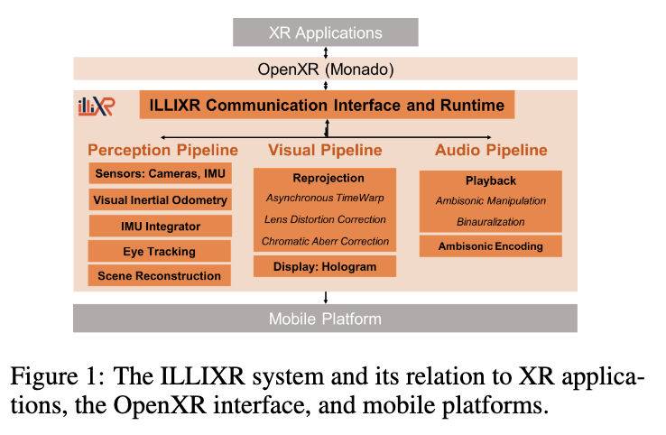
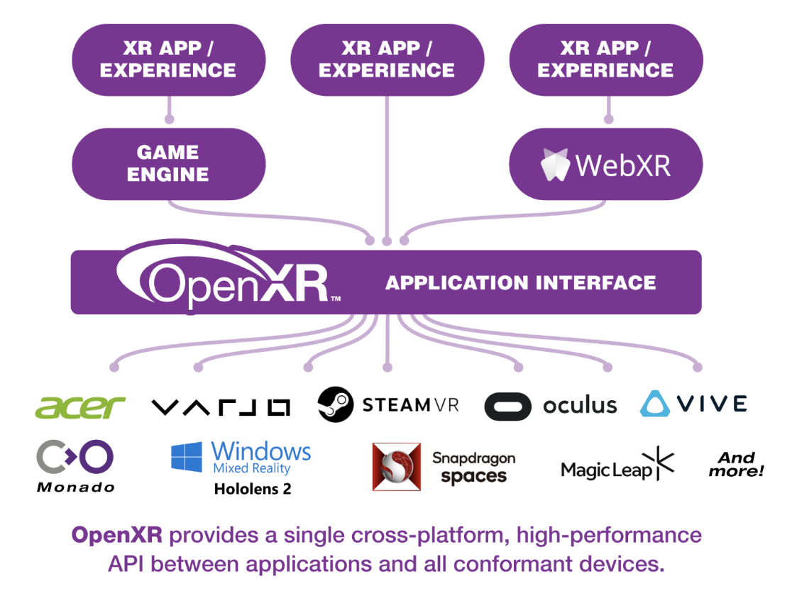
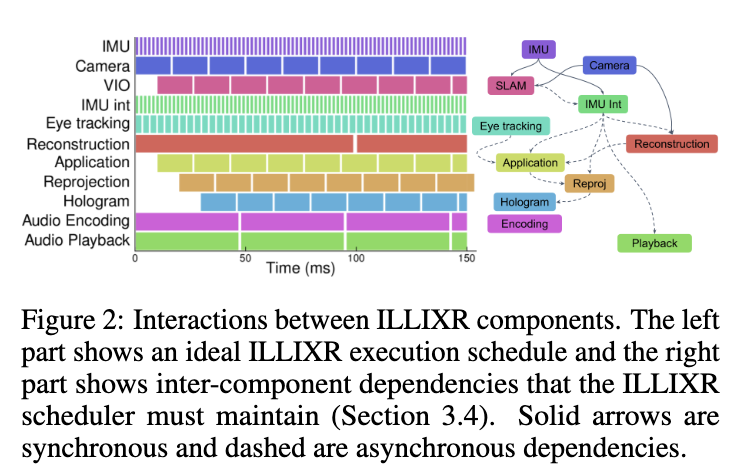

# Exploring Extended Reality with ILLIXR: A New Playground for Architecture Research

## Overview 

<!-- title, authors, venue -->
Huzaifa, M. et al. 2020. Exploring Extended Reality with ILLIXR: A New Playground for Architecture Research. arXiv [cs.DC].

### How Many Passes? 

<!-- just a quick indication of my understanding of the paper -->

:white_check_mark: :white_check_mark:

<!-- personal ratings, max: five stars-->

### My Ratings 

- novelty: :star: :star:
- readability: :star: :star: :star: :star: 
- reproducability: :star: :star: :star: :star: :star: 
- practicability: :star: :star: :star: :star: :star: 

## High-Level Ideas 

ILLIXR consists of an open-source design of three pipelines. 

- ILLIXR can support running typical XR applications. Though it seems that these XR applications have to be developed based on Monado. 

The authors' intention (at least original intention) is to target the computer architecture community. 
In essence, the authors envisioned ILLIXR to serve as an open-source benchmark that has reference implementations for the entire XR workflow.

ILLIXR is envisioned to serve as what the authors referred to as *a full system testbed*. 

The design and implementation of ILLIXR addressed two main challenges 

- identifying a representative XR workflow and includes many SToA algorithms for different components 
- has an OpenXR compliant implementation

Figure 1 very nicely captures the essence of ILLIXR.
One thing to note is that for an XR application to use ILLIXR, the application has to use OpenXR API. Consequently, application performance data can be measured at the ILLIXR-level.

{ width="45%" align=left }
{ width="45%"}

It might also be useful to compare ILLIXR to the OpenXR. IMO, they are quite similar and it would be useful to come back to understand the key differences later.
<!-- TODO -->

Figure 2 is a very nice diagram that illustrates the complexity of XR application scheduling. 
{ width="90%" align=center}

This reminds me of works that try to schedule the XR applications to deliver good user experiences, e.g., Heimdall, Layercake (our own work), and Linkshare. The key challenges comes down to how to schedule with dependencies. 

## Key Novelties 

An end-to-end modularized XR reference implementation! Most, if not all, components of ILLIXR are based on the existing works, which is a fine starting point.

A good introduction to the XR pipeline and a useful background reading.

Unlike a lot of AR works, including our own, that only focus on perception and visual results, ILLIXR also includes an audio pipeline.

## Evaluation Highlights 

It is cool that ILLIXR supports many performance metrics, including one called FLIP which I had never heard before but looks promising. In our own work, we had heavily relied on PSNR and SSIM but we definitely have noticed the limited expressiveness of those two metrics regarding human perception.  

The authors also presented an evaluation using ILLIXR, on three different hardware platforms including an NVIDIA Jetson AGX Xavier development board. I am excited to find out if I can replicate some of the experiments on my Xavier board! 

It is nice to see ILLIXR's capability to help evaluate different XR applications. Though the evaluation results are not very surprising. 

## Questions 

What are the key differences between Monado and ILLIXR? 

It is unclear how ILLIXR synchronizes the three pipelines. There are some discussions in Sec 3.2 Runtime about execution dependencies, though they are not quite the same thing. 

## A Closing Thought 

Overall I enjoyed reading this paper and have learnt something new. I admire the authors' efforts to support XR research community and I also share their ambitions! 

## References 

Yi, J. and Lee, Y. 2020. Heimdall: mobile GPU coordination platform for augmented reality applications. Proceedings of the 26th Annual International Conference on Mobile Computing and Networking (New York, NY, USA, Sep. 2020), 1–14.

Hu, B. and Hu, W. 2019. LinkShare: device-centric control for concurrent and continuous mobile-cloud interactions. Proceedings of the 4th ACM/IEEE Symposium on Edge Computing (Nov. 2019), 15–29.

Ogden, S. and Guo, T. 2023. LayerCake: Efficient Inference Serving with Cloud and Mobile Resources. THE 23rd IEEE/ACM International Symposium On Cluster, Cloud and Internet Computing (CCGrid'23).

