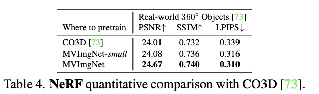
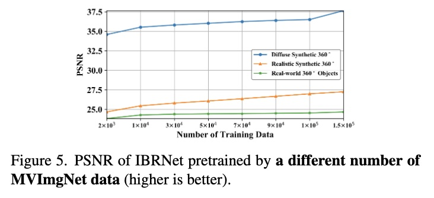

# MVImgNet: A Large-scale Dataset of Multi-view Images

## Overview 

<!-- title, authors, venue -->
Yu, X. et al. 2023. MVImgNet: A Large-scale Dataset of Multi-view Images. CVPR.

### How Many Passes? 

<!-- just a quick indication of my understanding of the paper -->

:white_check_mark: :white_check_mark:

<!-- personal ratings, max: five stars-->

### My Ratings 

- novelty: :star: :star: 
- readability: :star: :star: :star: :star:
- reproducability: :star: :star: :star:
- practicability: :star: :star: :star: :star: 

## High-Level Ideas 

A large scale dataset that consists of multi-view images.

- Why? Provide a generic dataset for 3D vision. The authors argue that other 3D datasets have limitations such as lacking real-world cues. 
- MVImgNet consists of 220k objects spanning 238 categories. 
- Capturing process: 
  - Videos captured by mobile devices 
  - Videos need to meet certain criterial: 
    - constraints on the videos: 0 seconds, not blurred, and each video has a dominant object 
    - constraints on objects: objects need to be stereoscopic, at least 180 degree view of the object; and the proportional of the object should be at least 15% in the video 
- Videos were captured by about 1000 collectors and the capturing quality is ensured by data cleaners 

## Key Novelties 

A large-scale open source dataset. 

The authors investigate the benefits of using MVImgNet dataset on a few vision tasks. 

- Radiance field reconstruction
- Multi-View Stereo: I am not convinced that MVImgNet helped much in this case. 

### Radiance field reconstruction

The authors chose a recent work called IBRNet and trained it in three different ways: from scratch, pre-train with CO3D, and pre-train with MVImgNet. I guess I am not surprised to see that IBRNet trained with MVImgNet achieves better results. It is a much larger dataset (220k objects and 238 categories) compared to CO3D (100 objects from 56 categories).

In fact, if we look at the Table 4 and Figure 5 from the paper, we see that:

- Compared to CO3D, MVImgNet-small, which is a random subset of the original dataset,  does not seem to improve the three metrics much.
- The impact on the PSNR metric is quite expensive: increasing the training dataset by an order of magnitude brings about 1dB to 2dB improvement in PSNR. 

{ width="600" }

{ width="600" }

A couple of things I wish the authors have explained are:
- How many times the experiments were repeated for the randomly generated subset? 
- How would different sampling methods impact the evaluation results?

### Multi-View Stereo

There are a few things that might be worthy revisiting:

- How exactly was MVImgNet used to train JDACS? 
- Table 5 shows that the depth map accuracy improves as the DTU training samples increase. This results are intuitive. What is interesting is that the accuracy gap between CO3D and MVImgNet-small is in favor of CO3D. If we look at Table 6, for both 4mm and 8mm error thresholds, JDACS trained with CO3D has higher accuracy. The accuracy improvement brought by MVImgNet also seems trivial. For example, training with MVImgNet only increases the accuracy from 78.39 (training with CO3D) to 78.58 while the dataset size difference is almost three order-of-magnitude. 

## Questions 

It seems that the camera intrinsic and extrinsic parameters is reconstructed from the videos. If a downstream task relied on these parameters, what are impacts on the task accuracy? 

- Why didn't the authors collect those camera parameters? 

The dense depth maps are also reconstructed using a general-purpose pipeline called COLMAP, rather than measured. As such, this dataset is probably not suitable for depth estimation related tasks.

## A Closing Thought 

I always like works that can help promote research efforts in the community. A large-scale dataset definitely fits the bell. Though I wish some of the important scene data were captured instead of inferred. 